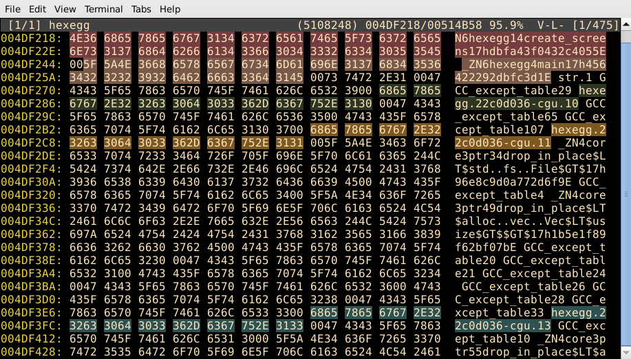

# hexegg

Cross-platform terminal hex editor with some advanced features.

  

### Features

- cross-platform, based on crossterm library
- simple custom color schemes with 16, 256, and full RGB support
- multiple input files
- highlight diffs between files
- toggle visibility of printable characters
- advanced block manipulation such as insert, delete, fill from generator other files, etc ...
- advanced search options
- results highlighting
- command interface
- minimal external dependencies

Please read the [manual](docs/MANUAL.md) to see all commands and features. 

### Install and run

Download and extract the [compiled](https://github.com/mr152here/hexegg/releases) zip file for your platform.

```
cd hexegg
chmod +x hexegg
```

If you want to build latest version from the source, clone git repository (or download sources as a zip file) and compile it with the cargo. You must have installed [rust](https://www.rust-lang.org) programming language to be able to compile it.

```
git clone https://github.com/mr152here/hexegg.git
cd hexegg
cargo build --release
```

And finally copy configuration [config.toml](config.toml) file to the same folder where compiled program is located.

To view/edit files just execute hexegg in terminal and pass file name(s) as arguments.

```
./hexegg <file1> [file2] [file3] ...
```

### Acknowledgment

Hexegg is written in the [rust](https://www.rust-lang.org) programming language using the following libraries:
- [crossterm](https://github.com/crossterm-rs/crossterm)
- [toml](https://github.com/toml-rs/toml)
- [serde](https://serde.rs/)

### License

Hexegg is licensed under the Apache 2.0 license. See the [LICENSE](LICENSE) file for details.
