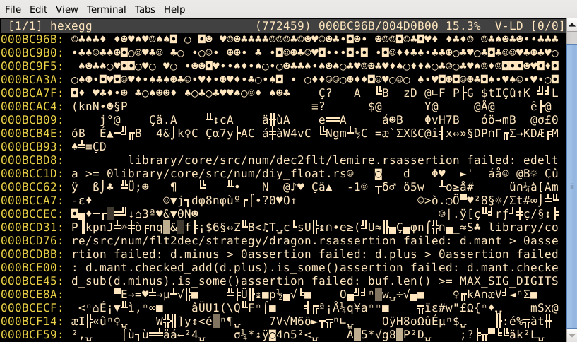
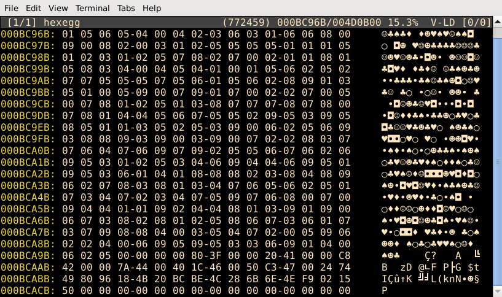
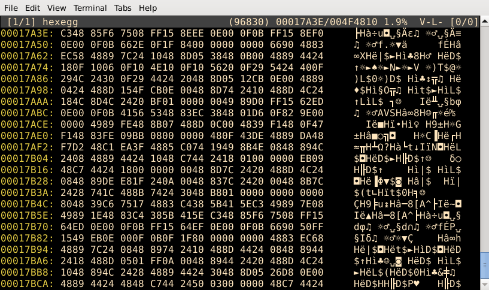
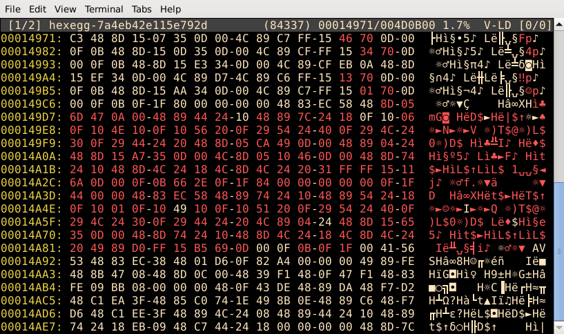
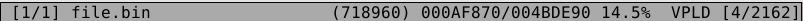

# hexegg (0.11)

Hexegg reads all input files specified by their names as command-line arguments.

```
hexegg [-t <size_limit>] <file1> [file2] [file3] ...
```

If *size_limit* is not specified, files are fully loaded into the memory. File size (and memory consumption) is not limited. If you wish to open large files, disks or streams with undefined size use *-t <size_limit>* parameter. Otherwise it may consume all your memory.

For example:
```
hexegg -t 1024 /dev/random
```

Another way to put data into hexegg is via STDIN (if set in config.toml).

```
echo "hello" | hexegg
curl https://duckduckgo.com | hexegg -t 100
```

## Basic controls

Basic controls are pretty intuitive. The arrow keys move the file viewing position or move the cursor if is visible (with SHIFT it moves 8x faster):
- UP - one line up
- DOWN - one line down
- LEFT - one byte up
- RIGHT - one byte down
- PGUP - one page up
- PGDOWN - one page down
- HOME - beginning of the file
- END - one page before the end of the file
- ENTER - cycle through the screens
- TAB - cycle through all opened files

Hexegg offers various interpretations of the input data. Those are called "screens". In the current version, there are three screens: text, byte and word screen. You can cycle between them using 'ENTER' key. Each screen reads its setting from the *config.toml* file. Where you can set which one is default, width of some user interace elements and even disable unwanted screens.

##### Text screen

Display data as they are in the file with (almost) cp437 character set.


##### Byte screen

Display data as hexadecimal values and also as their "text" values.


##### Word screen

Display data as hexadecimal values as a 2-byte pairs and their "text" values.


#### Program modes

The program is always in one of the four modes. The default mode is "view mode". In this mode, it is not possible to directly modify file content. And is intended to be used for preview, inspection, search, ...
The second mode is "normal mode". Is same as the "view mode" but with active cursor. Is intended to by used for command execution, selecting blocks, highlighting... All keyboard shortcuts works only in view or normal mode. The third mode is the "byte mode". The cursor is shown, and every 0-9, a-f, A-F key modifies the byte at the cursor position, and this modification is stored as a patch (which you can save to the file later). The last mode is the "text mode". In this mode, every pressed (printable) key creates that patch under the cursor location. Intended for string modification. Because many of the keyboard shortcuts are letters, most of them are not available in byte or text this mode.

Switching program modes:
- 'n' - switch the view mode to normal mode
- 'b' - switch the view mode to byte mode
- 't' - switch the view mode to text mode
- 'ESC' - return to the view mode from any other mode. In view mode cancel selection (if exists).
- 's' - start or finish selection (in normal mode)
- 'S' - select whole ascii string from the cursor position
- 'H' - select whole highlighted block from the cursor position
- 'U' - select whole "ascii-unicode" string from the cursor position
- 'y' - yank selected block, and send it to the external application via STDIN

If the program is in the "normal mode", you may select a block of bytes. Start by pressing the 's' key. Selection starts from the current cursor position, adjust it to the required size with standard movement keys, and press the 's' again to finish the selection (or you can cancel it anytime by 'ESC'). You can also select whole block of highlighted bytes by pressing 'H' with cursor somewhere in the highlighted block, entire (ASCII) string with 'S', or entire 2-byte width "ascii-unicode" string with 'U'.

You can yank (copy) selected block with 'y' key. This makes it easy to copy blocks from one file to another or a new file. To put yanked block to the file use *insertblock* or *appendblock* commands. To open block in a new file buffer use *openblock* command. External application can be set in the *config.toml* file by setting *yank_to_program* variable to appropriate values. If set, application is executed and recieve whole yanked block via STDIN pipe. E.g. this can be use to put yanked block to the system clipboard by executing xcopy, xsel, .., send it via network using netcat etc.

#### File buffers
Every file is read into separate file buffer. Content of the file buffers is no longer synchronized with the later changes in associated file. Every file buffer has separate content, patches, view offset, selections, highlights, etc..  Only current cursor or view offset can by synchronized if 'file buffer offset lock' is enabled. You can cycle through all file buffers using 'TAB' key.

#### Mouse

Mouse can be enable/disable by setting *mouse_enabled* in the configuration *config.toml* file. Is enabled by default. If your terminal doesn't support mouse, is recommended to disable it. You can move cursor anywhere to the file by left click (even if is not visible). To select a block, press and hold down left button and drag the mouse (if crossterm library support mouse drag event for your terminal). If not, you can always right click and block between cursor and current mouse position will be selected. Using mouse wheel, you can scroll through the file. To adjust its behavior check cofiguration file for *mouse_scroll_type* and *mouse_scroll_size* variables. Double click somewhere at highlighted block or ASCII string will select it. Same as 'H','S' keys.

#### Bookmarks

Command *bookmark* store actual cursor or file position in the boomark index register. You can than go to the stored locations by pressing its index number: '0','1' ... '9' if program is not in byte/text mode. Or by using *goto b* index command.

#### Patches

Almost every file modification is stored in the "patch map", which contains the original byte from the file and its new value. You can restore any byte to its original state in byte/text mode by pressing 'BACKSPACE' or 'DEL'. Just like in every standard text editor. When you extend a file or insert a new blocks, their original bytes are undefined and are arbitrary set to 0. When you delete part of the file, it can't be restored this way. There is no "undo" command.

#### More controls

- 'q' - in the view mode will quit the program. If the file is modified, you will be asked whether to save it
- ESC - will also quit program (if nothing else can't be canceled). Must be enabled in the config.toml 
- 'h' - toggles highlighting different bytes
- 'p' - show / hide non-printable characters (nice when looking for strings in binary blobs)
- 'k' - toggle the file buffer offset lock. When lock is enabled, it will move cursor or file offset in all opened files. Not only in current one.
- '.' - locate the next diff
- ',' - locate the next patch
- '+' - increase row size (nice when looking for some symetry or tables)
- '-' - decrease row size (nice when looking for some symetry or tables)
- 'i' - toggles the visibility of the info bar
- 'o' - toggles the visibility of the offset bar
- 'm' - highlight selected block
- 'M' - remove highlight from the selected block or its selected part

When you enable highlighting different bytes ('h' key), program shows those bytes in a different color, makes changes in files easy to spot. You can also use '.' key to jump to the next diff location.
  

#### Location bar

Whenever you perform an operation that may returns multiple results, the results are displayed on the right side of the screen in a panel called the "location bar". You can quickly goes through the results and their associated offsets using:
- ']' - navigate to the next location
- '[' - navigate to the previous location
- '}' - page down in location bar
- '{' - page up in location bar
- '<' - navigate to the currently selected item
- '>' - find highlighted block in location bar from the cursor position
- 'r' - rename item in the location bar
- 'R' - remove item from the location bar
- 'l' - toggles location bar visibility (shortcuts still works)

Location bar also support mouse events. By left clicking on the item, you will jump to its offset. By right clicking you will jump to the end offset. Double click to select whole block (if item has known size). Or you can quickly travers through results using mouse wheel.

#### Info bar

  

The info bar is at the top of the screen. There is information about the current file and program state. On the left is the current file index and the number of opened files. The current file name, where '+' indicates if the file has been modified. Next is the current position in the file in decimal, hexadecimal, and percentage representation. The following four (NPLD) letters indict:
> [-|N|B|T] - view, normal, binary or text mode  
> [P|-] - only printable characters  
> [L|-] - file buffer offset lock  
> [D|-] - diff highlighting

Following by number of results in location bar. With the 'i' key, you can toggle the visibility of the info bar.

## Commands

Hexegg has a build-in command interface with a simple history of last used commands. All non-basic functions are accessible through it.
- '/' - display the command prompt interface
- '\\' - repeat the last command
- ESC - cancel command
- ENTER - execute command
- UP - select a previous command from history
- DOWN - select a next command from history  
- BACKSPACE - delete previous character from the user string
- DEL - delete current character from the user string
- TAB - autocomplete command or show current command hints/possibilities

Next is a list of available commands, their parameters, and their descriptions. The parameters in [] are optional, the parameters in <> are mandatory, and the parameters in {} have predefined default values. If not stated otherwise, all parameters must be specified in order. You can specify command by typing its full name (e.g. *findallstrings*) or by typing its alias (e.g. *fas*). Aliases are defined in *config.toml* file. You can create/define your own.

#### Command list

*quit*  
*q*
> closes all files. For each modified file, asks whether to save it and then exits.

*quit!*  
*q!*
> abort all changes and quit. 

*goto \<position\>*  
*g \<position\>*
> go to the file *position*. Specified as a decimal or hexadecimal value. If *position* starts with + or - sign, then is interpreted as relative value from the current position. And if starts with 'b' than is interpreted as bookmark index.
> 
> 'goto 152' - go to to the file offset 152  
> 'g 10' - go to the file offset 10  
> 'g xBEEF' - go to the file offset 48879  
> 'g -x10' - go 16 bytes back from the current position  
> 'g +50' - go 50 bytes forward  
> 'g b5' - go to the bookmark 5 position

*bookmark \<bookmark_index\>*  
*b \<bookmark_index\>*
> store the current position in the boomark register under the *bookmark_index* number. You can go to the stored location with *goto* command or by pressing that index number key (0,1,2,..).

*findallbookmarks*  
*fab*
> show all bookmarks and their indexes in the location bar.

*findallpatches*  
*fap*
> find all existing patches and show their offsets in the location bar. 

*findalldiffs*  
*fad*
> find all diffs (different bytes among all opened files) and show their offsets in the location bar.

*findallhighlights*  
*fah*
> find all highlighted blocks and show their offsets in the location bar.

*findallsignatures \[sig_name\]* ...  
*fasi \[sig_name\]* ...  
> find the locations of embedded blocks specified with one or more *sig_name* parameter. If nothing is specified, find all known signatures. Currently implemented signatures are for: 7zip, ani, avi, bmp, bzip2, cab, cdr, deb, dls, dmg, elf, fat, gif, gzip, ico, java, jpeg, lz4, lzip, lzo, macho, midi, mzpe, nsis, pcap, pcapng, png, rar, rpm, vcd_dat, wav, webp, xar, xz, zip, zpaq
> 
> 'fasi' - find all known signatures  
> 'fasi elf gzip xar' - find locations of all "ELF", "GZIP" and "XAR" signatures

*findallsignatures! \[sig_name\]* ...  
*fasi! \[sig_name\]* ...  
> find location of all signatures that are NOT specified. If nothing is specified, return all known signatures.
> 
> 'fasi!' - find all known signatures  
> 'fasi! elf gzip xar' - find all signatures, except "ELF", "GZIP" and "XAR"

*find \[pattern\]*  
*f \[pattern\]*
> find and go to the next position of the *pattern* from the current position. *pattern* can mix of printable and escaped hexadecimal characters. If no pattern is specified, bytes from the currently selected block are used.
> 
> 'find hello' - find next position of 'hello'  
> 'f abc\\\\def' - find next position of 'abc\def'  
> 'f need\x20\xCA\xFE',  
> 'f \x0\x01\x2\x3\xF\x0F'

*findall \[pattern\]*  
*f \[pattern\]*
> find and show all positions of the *pattern* (or selected block if not specified) in the location bar. See *find* command for *pattern* syntax.

*findhex \<bytes\>*  
*fx \<bytes\>*
> wrapper around the *find* command. Works the same way but is faster to type when you are searching only for hexadecimal characters. *bytes* must be space separated.
> 
> 'findhex C0 01 5E ED'  
> 'fx 0 1 EA 12'

*findallhex \<bytes\>*  
*fax \<bytes\>*
> wrapper to the *findall* command with *findhex* syntax.

*findstring \{min_size = 4\} \[regex\]*  
*fs \{min_size = 4\} \[regex\]*
> find and jump to the beginning of the next string that is at least *min_size* long and contains and matches *regex*. If the first parameter can be converted into the integer, then specifies *min_size*, otherwise specifies *regex*. The second *regex* parameter is used only when the first one is *min_size*. A string is a sequence of printable ascii characters that starts after and ends before any non-printable character. Not necessary the zero-byte.
> 
> 'fs 10' - find the next string that is at least 10 bytes long.  
> 'fs hexedit' - find the next string that is at least contains 'hexedit'  
> 'fs 20 hexedit' - find the next string that is at least 20 bytes in size and contains 'hexedit'  
> 'fs 15 10' - find the next string that is at least 15 bytes in size and contains '10'  
> 'fs ^[Hh]exedit' - find the next string that starts with 'hexedit' or Hexedit 

*findallstrings \{min_size = 4\} \[regex\]*  
*fas \{min_size = 4\} \[regex\]*
> find all strings in the file and show them in the location bar. Works the same as *findstring* but locates all strings, not just the next one.

*findunicodestring \{min_size = 4\} \[regex\]*  
*fu \{min_size = 4\} \[regex\]*
> same as *findstring* except it works on "ascii-unicode" type string. That are 16bit wide characters strings, where every 1st is ascii and every 2nd byte is a zero-byte. Like H\x00e\x00l\x00l\x00o\x00 sequence. Parameters are specified as ascii string and *min_size* is number of characters.

*findallunicodestrings \{min_size = 4\} \[regex\]*  
*fau \{min_size = 4\} \[regex\]*
> find all "ascii-unicode" strings in file and show them in the location bar. Works the same as *findunicodestring*, but locates all strings, not just the next one.

*replaceall /[pattern/]*
> replace all items from location bar by *pattern* or selected block (if *pattern* is not specified). Items in the location bar must be the size as *pattern* or block.

*filter \[regex\]*
> filter results in Location Bar and display only that matches regex. To reset filter, use *filter* command with empty *regex*.

*deleteblock*
> delete selected block from the file

*openblock*
> open selected or yanked block as a new file. Selection takes priority.

*saveblock \<filename\>*
> save the selected block into the file with *filename*.

*exportblock
> export selected block as a text file with filename 'export_<offset>.txt'. Each row contains formated 16 bytes and content can be easily inserted into documents, articles, source codes ...

*fillblock \[pattern\]*
> fill the selected block with *pattern*. If the number of bytes in pattern is less than the block size, *pattern* will be repeated. If *pattern* is not specified, a block will be filled with 0.
> 
> 'fillblock' - fill the selected block with 0x00.  
> 'fillblock \xFF' - fill the selected block with 0xFF.  
> 'fillblock \x10\x20\x30' - fill the selected block with repeated bytes 0x10, 0x20, 0x30  ...  
> 'fillblock M\x40il\\' - fill the selected block with repeated bytes M@il\ ...

*yankblock*
> copy selected block into the yank buffer. If nothing is selected, buffer is cleared.

*insertblock*
> insert selected or yanked block into the file at the cursor position. Selection has higher priority.

*appendblock*
> same as *insertblock* but put block after the cursor position.

*insertfilledblock \<size\> \[pattern\]*
> create and insert a filled block at the cursor position. *size* is the requested size of the block and may be in decimal or hexadecimal notation. *pattern* has the same syntax and will be repeated if is shorter then block *size*. Same as in the *fillblock* command. If not specified, it will create a block filled with 0.
> 
> 'insertfilledblock x10' - will create and insert a block of size 16 filled with 0x00  
> 'insertfilledblock 7 \x20\x30\x40' - will create and insert block of size 7 and filled with 0x20, 0x30, 0x40, 0x20, 0x30, 0x40, 0x20

*appendfilledblock \<size\> \[pattern\]*
> same as the *insertfilledblock* but will create and put block after the cursor position.

*pipeblock \<program_name\> \[arg1\] \[arg2\] ...*
> Run *program_name* with arguments. Program will recieve selected block via STDIN. Then wait until program ends its job.

*insertfile \<filename\>*
> load and insert *filename*'s content at the cursor position.

*appendfile \<filename\>*
> load and insert *filename*'s content after the cursor position.

*openfile \<filename\> \[size_limit\]*
> open *filename* and load its content into a new file buffer. If *size_limit* is specified, read up to *size_limit* bytes from the file. You may cycle through all opened files with the TAB key.

*closefile*
> close the current file. If the file is modified, you will be asked whether to save the changes or not. If there are no more opened files, the program will quit.

*savefile \[filename\]*
> save the current file buffer with all its modifications as a *filename*. If *filename* is not specified, the file is saved under its own name. Files that are NOT opened with *<size_limit>* are truncated and a new file will be content of the filebuffer. Files opened with *<size_limit>* are not truncated, only that part of the file is overwritten and the rest is intact.

*parseheader \[header_name\]*
> parse, show and highlight binary structure at the current position. If *header_name* is not given, it will first try to find correct signature at the position and than parse it. Currently recognized structures are: BMP, ELF, GIF, ICO, JPEG, MZ, MZPE, PE, PCAP, PCAPNG, PNG.
> 
> parseheader bmp - parse file from current position as a BMP structure
> parseheader mz - parse file from current position as a (only) MZ structure
> parseheader mzpe - parse file from current position as a MZPE structure

*entropy \{block_size = 1024\} \{margin = 1.1\}*  
*ent \{block_size = 1024\} \{margin = 1.1\}*
> split file into blocks of *block_size* size, calculate the entropy of each one, and if the difference between two following blocks is less then the *margin*, join them together. Entropy values of resulting blocks are in the location bar. The associated offset is starting offset of the block. For the wisely chosen parameters, command can be used to navigate quickly through the interesting areas.

*histogram*
> calculate file histogram and display result in the location bar. Format is "\<byte_value\>_\<amount\>" and is sorted by amount with the highest on the top.

*clearlocationbar*
> clear all results from the location bar, including all highlights.  

*set \<variable_name\> \<variable_value\>*
> set values of inner variables in the running program. *variable_name* must be one from 'colorscheme', 'highlightstyle', 'screenpagingsize'. *variable_value* is a variable name specific and can be found in the configuration file config.toml.

*suspend*
> suspend hexegg and put it into the terminal background. The same as standard CTRL+z shortcut. Only for Linux/Unix based OS.
